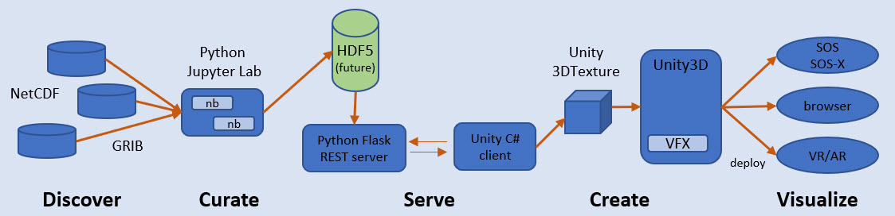

Click here to launch an interactive container: 

# GPU-Based Vector Field Visualizations using 3D Textures

The goal of this project is to create information-rich visualizations for geo-science that have useful interpretations for scientists and educators. To accomplish this goal, new features in [Unity](https://unity.com/) are leveraged to utilize GPU-based particle systems, with a focus on 3D vector force fields. By creating a volume having a 3D vectors at each point, we can inject particles into this volume and watch the dynamics. An analogy is a pin-ball machine, whose mechanisms supply the dynamics that effect ordinary balls. 

* **Stage 1 -- Discover** - Find NetCDF or GRIB datasets that contain 3D vector fields (3D space with U-V-W values at each point)
* **Stage 2 -- Curate** - Store curated vector fields in library to be used by server. 
* **Stage 3 -- Serve** - Construct REST web API to serve data to C# client within the Unity environment. 
* **Stage 4 -- Create** - Create Unity 3D texture assets to be used in VFX graphs.
* **Stage 5 -- Visualize** - Use 3D textures as property within VFX graph blocks. 

The architecture converts [NetCDF](https://www.unidata.ucar.edu/software/netcdf/) & [GRIB](https://en.wikipedia.org/wiki/GRIB) datasets into force vector fields for rendering as [3DTextures](https://docs.unity3d.com/Manual/class-Texture3D.html) in [Unity Visual Effect Graphs](https://unity.com/visual-effect-graph). In the future, it might be interesting to investigate storing these textures in an [HDF Server](https://s3.amazonaws.com/hdfgroup/docs/HDFServer_SciPy2015.pdf).

Issues to be resolved:

* Mapping dataset dimensions and values to 3D texture dimensionds and values
* Specifying slices of the dataset dimensions to the server
* Managing a library of datasets to be visualized
* Bringing the real-world interpretation of these dimensions into Unity
* Varying the VFX graph to show different aspects of the UVW field
* Rigging camera to best visualize the UVW rendering

# Documentation

- In addition to the python, the Unity VFX sample project should be cloned from https://github.com/Unity-Technologies/VisualEffectGraph-Samples
- Add the texture3d unity package found in the unity folder to the cloned VFX samples
- More to follow...
