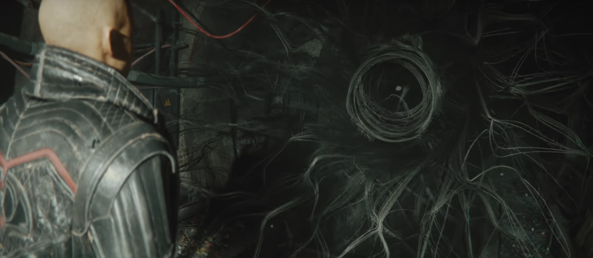

# GPU-Based Vector Field Visualizations using 3D Textures

The goal of this project is to convert [NetCDF](https://www.unidata.ucar.edu/software/netcdf/) & [GRIB](https://en.wikipedia.org/wiki/GRIB) datasets into force vector fields for rendering as [3DTextures](https://docs.unity3d.com/Manual/class-Texture3D.html) in [Unity Visual Effect Graphs](https://unity.com/visual-effect-graph). 

Specific functions include:

- Exploring the characteristics of NetDCDF/GRIB datasets

# Documentation

- In addition to the python, the Unity VFX sample project should be cloned from https://github.com/Unity-Technologies/VisualEffectGraph-Samples
- The included unity package should installed in that project.
